# (Dés)Ordres
Workshop donné à l'occasion des portes ouvertes 2020 du Master Media Design de la HEAD–Genève

### Atelier d'impression de motifs génératifs inspiré par le travail de Vera Molnar
- Les visiteur·euse·s tirent trois dés à six faces
- La première valeur définit le nombre de colonnes et de lignes de la grille
- La deuxième valeur définit le nombre de carrés concentriques
- La troisième valeur définit l'intensité de déplacement des sommets de chaque carré
- Le motif est exporté en PDF
- Le fichier est imprimé à l'aide d'un plotter de dessin Axidraw

## Crédit

David Heritier

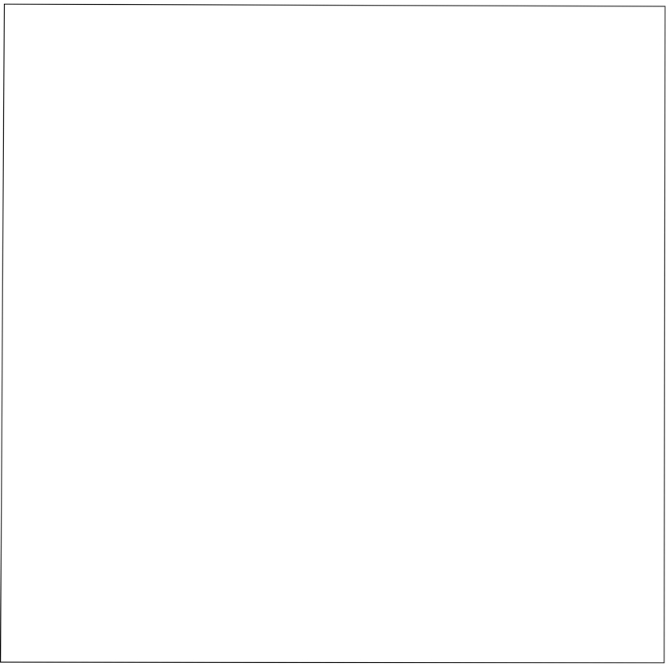
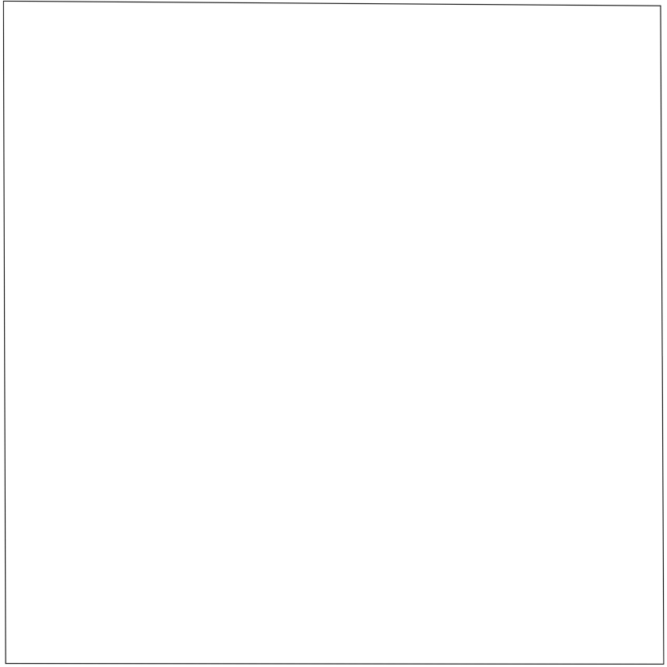
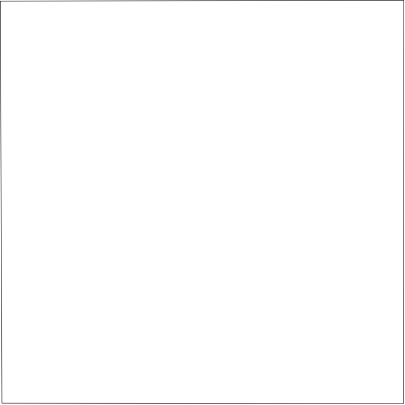
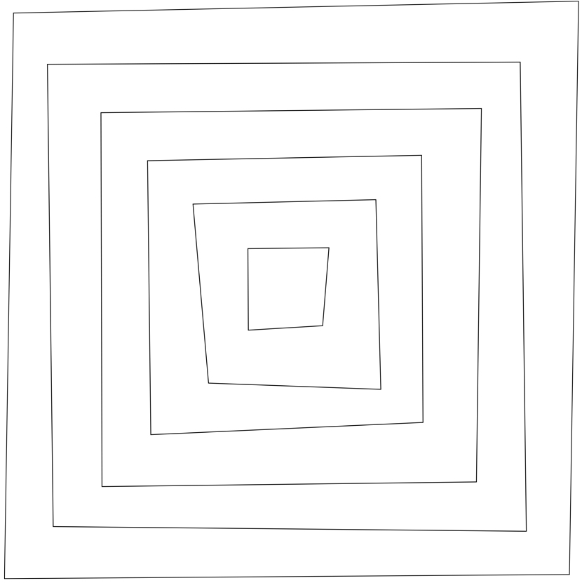
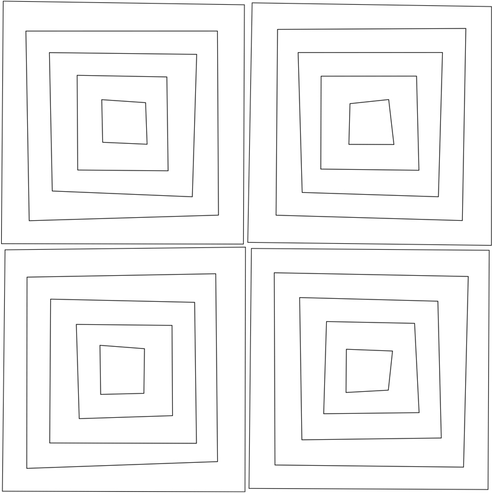
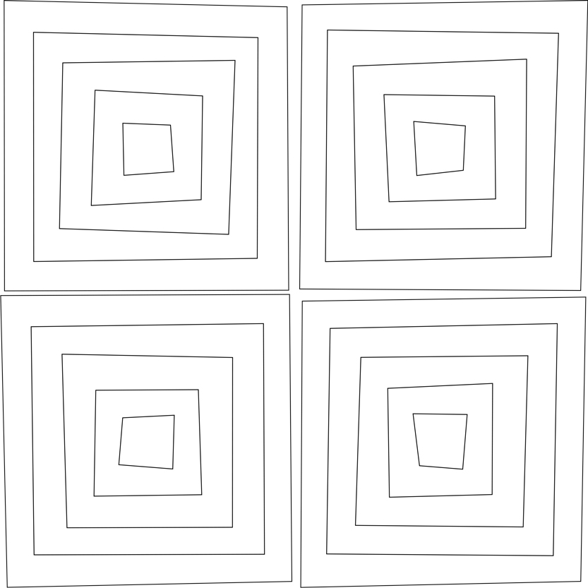
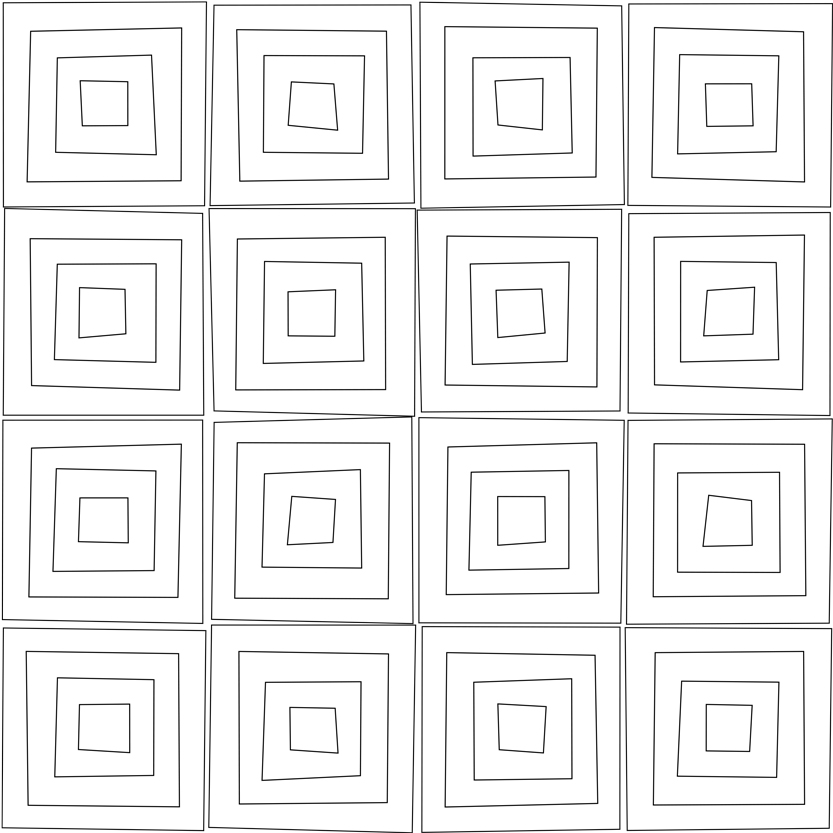
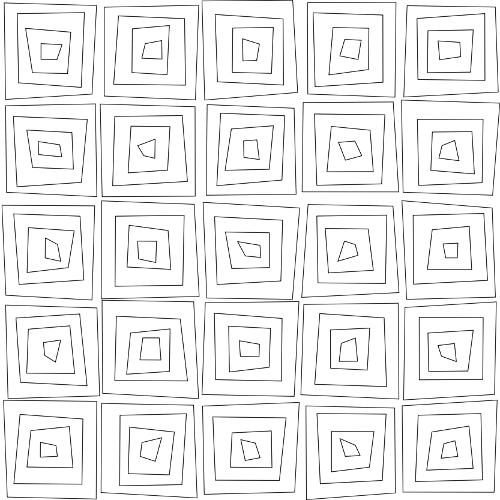
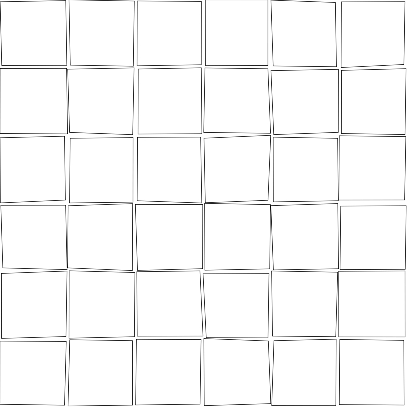
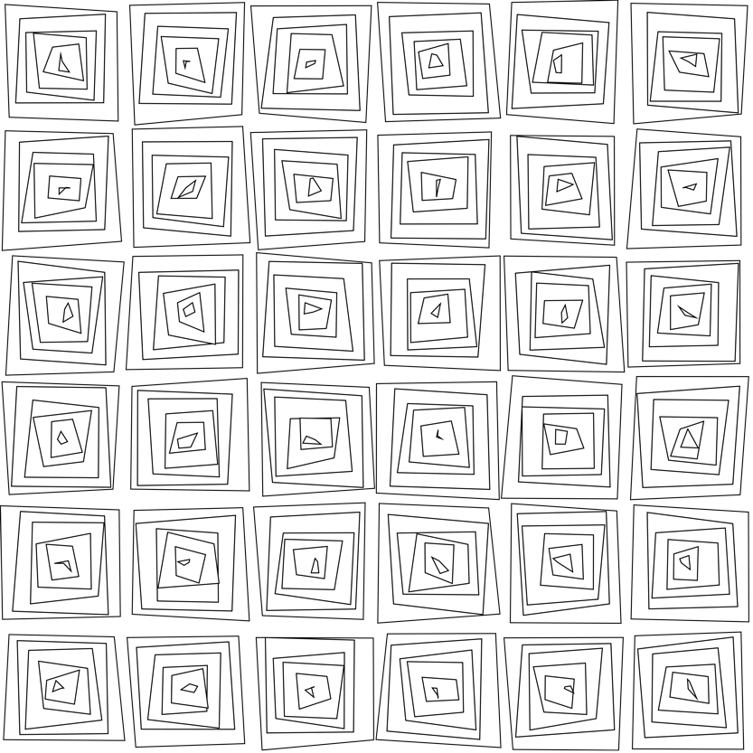
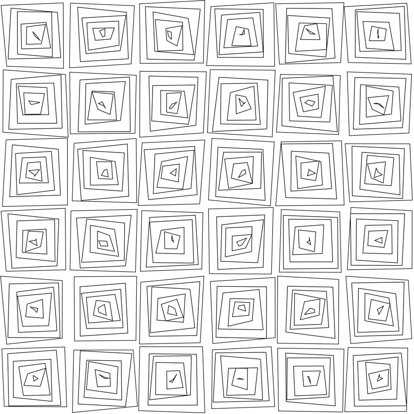
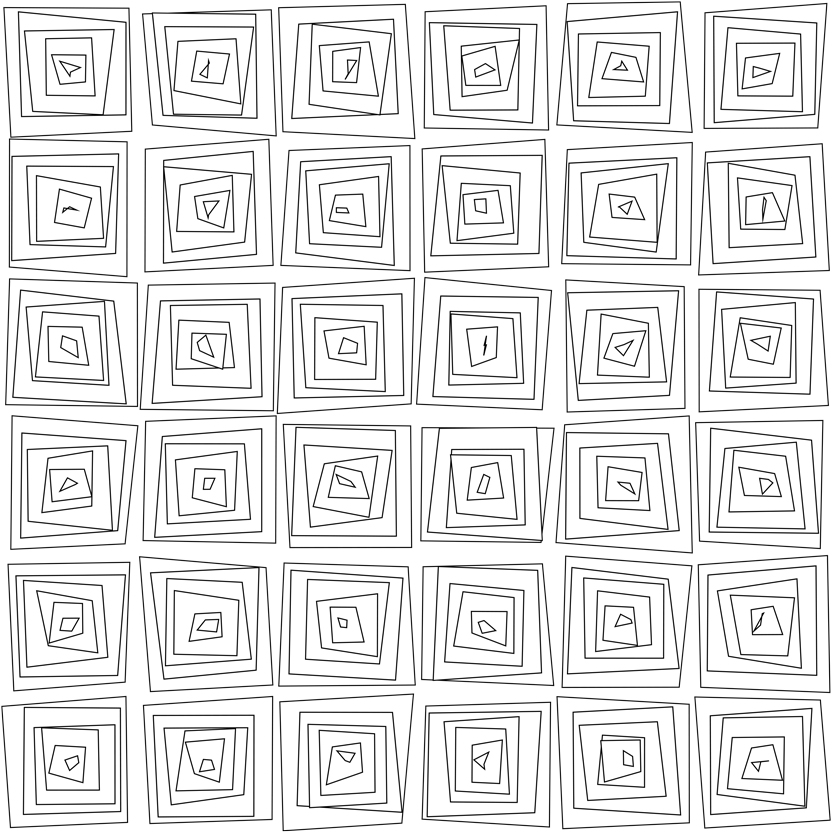
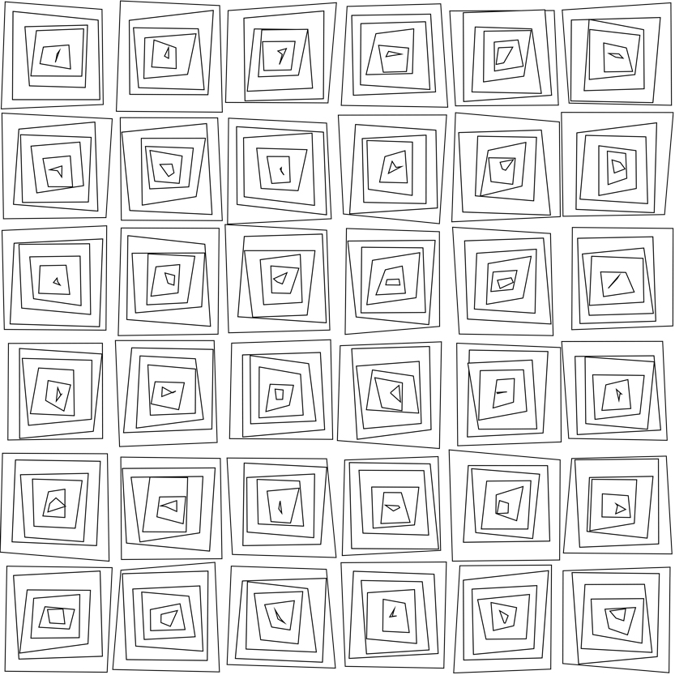
